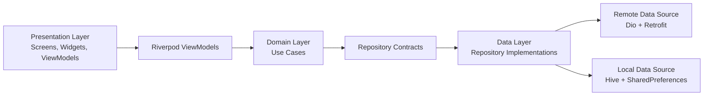

# ShopKart

ShopKart is a production-ready Flutter e-commerce application built with Clean Architecture, MVVM, Riverpod, Dio, Retrofit, Hive, and Material 3. The app uses the [Fake Store API](https://fakestoreapi.com) and is structured to demonstrate the kind of maintainable, scalable codebase expected in a professional Flutter portfolio or Android developer interview.

## Highlights

- Clean Architecture with clear presentation, domain, and data boundaries
- Feature-based folder structure for auth, home, product, cart, wishlist, and profile
- Riverpod ViewModels for predictable state management
- Repository pattern with remote API and local cache support
- Dio + Retrofit networking layer
- Hive persistence for products, cart, and wishlist
- SharedPreferences persistence for auth session and theme settings
- Material 3 light, dark, and system theme support
- Product search with debouncing
- Category filtering and incremental product pagination
- Pull-to-refresh, loading, error, and empty states
- Product detail screen with Hero animation
- Unit tests for repositories, use cases, models, cache, and cart logic
- Verified with `flutter analyze` and `flutter test --coverage`

## Architecture

ShopKart follows Clean Architecture and MVVM. UI widgets observe Riverpod ViewModels, ViewModels call use cases or repositories, repositories coordinate remote/local data sources, and domain entities remain independent from framework-specific implementation details.



## Project Structure

```text
lib/
  core/
    constants/
    errors/
    network/
    routing/
    theme/
    utils/
    widgets/
  features/
    auth/
      data/
      domain/
      presentation/
    cart/
      data/
      domain/
      presentation/
    home/
      presentation/
    product/
      data/
      domain/
      presentation/
    profile/
      presentation/
    wishlist/
      data/
      domain/
      presentation/
  injection/
  shared/
    data/
    domain/
  main.dart
test/
  features/
  shared/
```

## Features

### Authentication

- Mock login and registration flow
- Email/password validation
- Persisted local auth session
- Logout support

### Product Catalog

- Product grid from Fake Store API
- Product cards with image, title, price, rating, and category
- Pull-to-refresh
- Search with debounce
- Category chips
- Incremental pagination over the loaded catalog
- Offline product/category cache fallback

### Product Details

- Large cached product image
- Product title, category, rating, price, and description
- Hero animation from product card to detail screen
- Add to cart action

### Cart

- Add products to cart
- Increase/decrease quantity
- Remove items by reducing quantity to zero
- Total price calculation
- Local persistence with Hive

### Wishlist

- Add/remove favorite products
- Persist wishlist locally
- Dedicated wishlist grid

### Profile and Theme

- User profile summary
- Light, dark, and system theme selection
- Persisted theme preference
- Logout action

## API

Base URL:

```text
https://fakestoreapi.com
```

Used endpoints:

```text
GET /products
GET /products/{id}
GET /products/categories
GET /products/category/{category}
```

## Tech Stack

- Flutter and Dart
- Riverpod
- Dio
- Retrofit
- Hive
- SharedPreferences
- GetIt
- Injectable
- Json Serializable
- Freezed annotations
- Cached Network Image
- Shimmer
- GoRouter
- Mocktail
- Flutter Lints

## Getting Started

### Prerequisites

- Flutter stable SDK
- Dart SDK included with Flutter
- Android Studio or VS Code
- Android emulator, iOS simulator, or connected device

Check your setup:

```bash
flutter doctor
```

### Installation

```bash
git clone <your-repository-url>
cd shopkart
flutter pub get
```

Generate code when changing Retrofit or JSON models:

```bash
dart run build_runner build --delete-conflicting-outputs
```

Run the app:

```bash
flutter run
```

## Testing

Run all tests:

```bash
flutter test
```

Run tests with coverage:

```bash
flutter test --coverage
```

Current verification result:

```text
flutter analyze: no issues found
flutter test --coverage: all tests passed
coverage: 83.56%
```

## Screenshots

Add screenshots after running the application:

```text
screenshots/home-light.png
screenshots/product-detail-dark.png
screenshots/cart.png
screenshots/wishlist.png
screenshots/profile-theme.png
```

Example Markdown:

```md


```

## Interview Talking Points

- The app separates business rules from UI and data access, making repositories and use cases easy to test.
- Riverpod keeps state explicit and composable without tightly coupling widgets to service classes.
- Repository implementations gracefully fall back to local Hive cache when network calls fail.
- Cart, wishlist, theme, and auth state persist locally for a better user experience.
- Feature-based folders keep related code together while preserving Clean Architecture boundaries.

## Recommended Commit History

```text
feat: scaffold shopkart flutter application
feat: add clean architecture product catalog
feat: integrate fake store api with dio and retrofit
feat: add hive cache for offline product data
feat: add auth cart wishlist and profile flows
feat: add material 3 light and dark themes
test: cover repositories use cases and local cache
docs: document architecture setup and features
```

## Future Improvements

- Real authentication backend
- Payment gateway integration
- Product sorting and advanced filters
- Golden tests for critical UI states
- CI pipeline with analyzer, tests, and coverage gate
- Internationalization support
- Accessibility audit and semantic widget tests

## License

This project is intended for portfolio and learning purposes. Add your preferred license before publishing it publicly.
